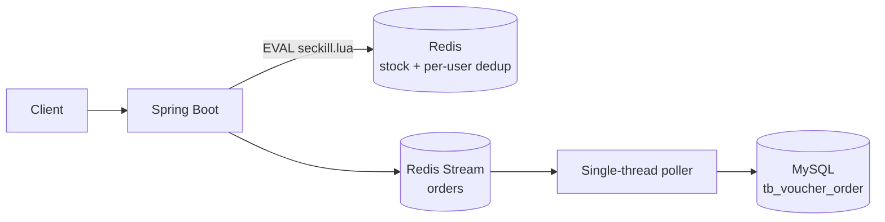
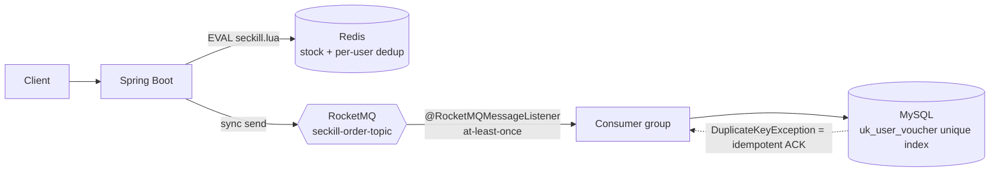

# Distributed Flash-Sale Order Platform

> Original architecture used Redis Stream + a single-thread polling consumer; under
> 1000-concurrent load each round left ~100 unconsumed pending messages.
> This rewrite replaces that pipeline with RocketMQ async delivery + a MySQL `uk_user_voucher`
> unique index for idempotent consumption.
> Measured on AWS us-east-1: **1463 QPS, 0 errors, 0 duplicate orders, 0 pending messages**
> across 3 rounds — full consistency in every round.

Spring Boot flash-sale service re-architected for durable async order creation, idempotent consumption, and AWS deployment. The original architecture used a Redis Stream + single-thread consumer path with an in-memory voucher order stage; this rewrite replaces that hot path with RocketMQ, backstops it with a MySQL unique index for exactly-once effective semantics, and ships as a linux/amd64 container running on AWS EC2 behind RDS MySQL and ElastiCache Redis.

## Architecture

Before

After

Atomicity in Redis (Lua), durability via RocketMQ (at-least-once), exactly-once *effective* semantics enforced by the database unique constraint.

## Why this design

- Distributed exactly-once protocols (2PC, transactional messages) require coordinator state and check-back listeners — operationally fragile.
- This rewrite picks at-least-once delivery + a business-side invariant (one user, one order per voucher) enforced as a database unique index.
- The unique constraint pushes the "exactly-once" guarantee from the protocol layer down to the storage layer, which is simpler to reason about and harder to break.
- Verified end-to-end by `benchmark/check_consistency.py`, which compares DB order count vs. distinct users vs. Redis stock vs. consumer pending after every benchmark round.

## What was changed

1. **Redis Stream → RocketMQ for seckill order creation** — the Lua-gated stock check still runs in Redis (fast path); the resulting order is handed to RocketMQ (`seckill-order-topic`) and persisted by a `@RocketMQMessageListener` consumer group instead of a custom polling loop.
2. **Idempotent consumer** — `tb_voucher_order` has a unique index `uk_user_voucher (user_id, voucher_id)` (migration `V2__add_voucher_order_unique.sql`). The consumer performs a `getById` fast-check, then tolerates `DuplicateKeyException` on insert as an idempotent no-op. At-least-once delivery from RocketMQ is therefore safe.
3. **AWS deployment** — reproducible AWS CLI runbook provisions VPC (2 AZs, public + private subnets), 4 Security Groups with SG-to-SG references (no CIDR for data plane), RDS MySQL in private subnet, ElastiCache Redis in private subnet, ECR for the app image, and 2 EC2 instances (app + RocketMQ). Build uses `docker buildx --platform linux/amd64` to produce an EC2-compatible image from Apple Silicon. Full details and teardown script: [docs/aws-deploy.md](docs/aws-deploy.md).
4. **Benchmark harness** — `benchmark/seckill-baseline.jmx` (1000 concurrent, stock=100, 3 rounds, unchanged across all environments) + Python helpers (`prepare_tokens.py`, `reset_state.py`, `check_consistency.py`, `summarize_jtl.py`, `aggregate_summaries.py`). Runs are archived per phase under `benchmark/results/`.

Deep-dive on architecture trade-offs and scale-up considerations: [docs/architecture.md](docs/architecture.md).

## Three-environment benchmark (same JMeter plan, no modifications)

| Metric | Local — Redis Stream | Local — RocketMQ + idempotent | AWS — RocketMQ + idempotent |
|---|---:|---:|---:|
| QPS | 1190.37 | 1181.05 | **1463.43** |
| P99 (ms) | 228.67 | 181.34 | 1387.42 (laptop↔us-east-1 RTT floor ~200 ms) |
| Error rate | 0.00% | 0.00% | **0.00%** |
| Consistency (100 stock / 100 distinct users / 0 pending) | ✓ | ✓ | **✓** |
| Pending messages leftover after run | 100 (Stream pending-list) | 0 | **0** |

Full write-ups: [benchmark/comparison.md](benchmark/comparison.md), [benchmark/aws-production.md](benchmark/aws-production.md), [benchmark/baseline.md](benchmark/baseline.md), [benchmark/after-rocketmq.md](benchmark/after-rocketmq.md).

Honest note on latency: the AWS P99 jump is client-side — RTT from a laptop in California to us-east-1 compounds with 1000-thread ramp-up. The durable server-side claim is zero errors + zero duplicate orders + zero pending messages across every round.

## Phase tags

| Tag | What ships |
|---|---|
| `v0.1-p0` | Baseline benchmark assets |
| `v0.1-p1` | Redis Stream → RocketMQ producer/consumer |
| `v0.1-p2` | Unique index + `DuplicateKeyException` fast-ack |
| `v0.1-p3` | Local post-change benchmark |
| `v0.1-p4` | Dockerfile + ECR push script |
| `v0.1-p5a` | `linux/amd64` buildx for EC2 |
| `v0.1-p5` | AWS deployment runbook (`docs/aws-deploy.md`) |
| `v0.1-p6` | AWS production benchmark + 3-env comparison + README |

## Resume bullets (what this project demonstrates)

- **Replaced Redis-Stream-based flash-sale order pipeline with RocketMQ async messaging** (producer in seckill service, `@RocketMQMessageListener` consumer group on `seckill-order-topic`), eliminating the custom polling loop and gaining standard ack/retry/offset semantics. 1000-concurrent 3-round benchmark: zero errors, pending messages drained to 0 on every round (vs. 100 leftover per round on the Redis Stream version).
- **Made the RocketMQ consumer idempotent under at-least-once delivery** via MySQL unique index `uk_user_voucher (user_id, voucher_id)` + `DuplicateKeyException` fast-ack, keeping exactly-once *effective* order creation without a distributed-transaction coordinator. Verified by a consistency checker comparing DB order count, distinct users, Redis stock, and consumer pending — all matched target in every round.
- **Deployed to AWS (us-east-1)** as containerized workload on EC2 behind RDS MySQL + ElastiCache Redis + self-hosted RocketMQ, pushed via ECR with `docker buildx --platform linux/amd64` from Apple Silicon; VPC split into public/private subnets with SG-to-SG references; reproducible via AWS CLI runbook + one-command teardown.
- **Benchmarked across 3 environments with identical JMeter plan** (local Redis-Stream baseline / local RocketMQ / AWS production), producing a side-by-side table with honest separation of server-side throughput (1190 → 1181 → 1463 QPS) vs. client-side latency (which inflates on AWS due to laptop↔cloud RTT, not server regression).
